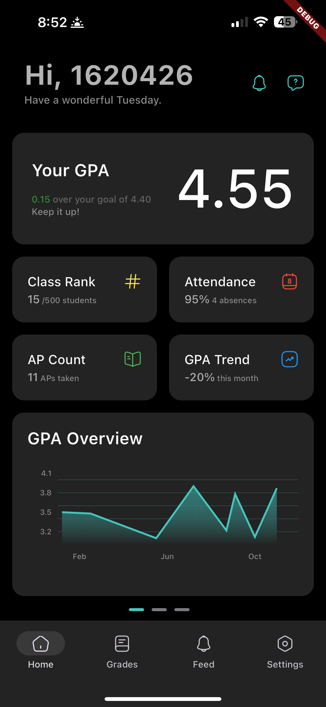
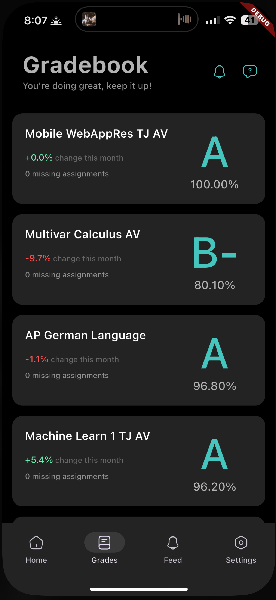
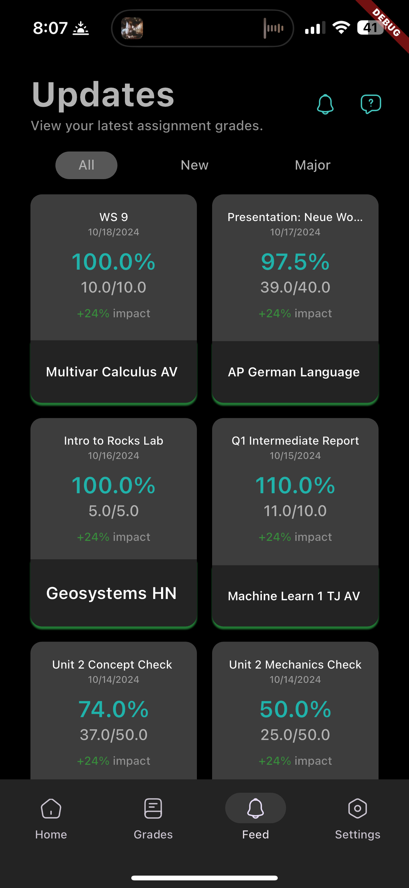

# 🧠 GeneSIS

## 📌 Overview
GeneSIS is a mobile app that empowers students to track their academic progress in real-time by connecting to existing student grading portals, like StudentVUE. Designed with privacy, insight, and user experience in mind, the app provides a sleek, dark-themed dashboard with GPA calculations, grade trends, and customization options. It’s built for students who want a clear, private, and intelligent overview of their academic journey.

---

## 🚀 Features
- ✅ Connects to StudentVUE and Genesis grade portals using user credentials
- ✅ Beautiful dark-themed dashboard with aqua-to-deep-blue grade color scale
- ✅ Supports rolling and standard gradebooks
- ✅ Computes current and cumulative GPA, even for partial-year data
- ✅ Stores credentials locally on-device for privacy
- ✅ Grade statistics and trends over time
- ✅ User profile and settings customization

---

## 🛠️ Technologies Used

| Area            | Stack/Tools                                   |
|-----------------|-----------------------------------------------|
| Backend         | StudentVUE API                                |
| Frontend        | Flutter, Dart, GetX                           |
| State Mngmnt    | GetStorage                                    |
| Other Tools     | Git, Figma                                    |

---

## 📷 Screenshots

<table>
  <tr>
    <td align="center">
      <br/>
      <sub><b>Dashboard</b></sub>
    </td>
    <td align="center">
      <br/>
      <sub><b>Gradebook</b></sub>
    </td>
    <td align="center">
      <br/>
      <sub><b>Feed</b></sub>
    </td>
  </tr>
</table>

---

## 🧪 How to Run Locally

```bash
# Clone repo
git clone https://github.com/IshanA2007/geneSIS.git
cd geneSIS

# Get Flutter packages
flutter pub get

# Run the app
flutter run
