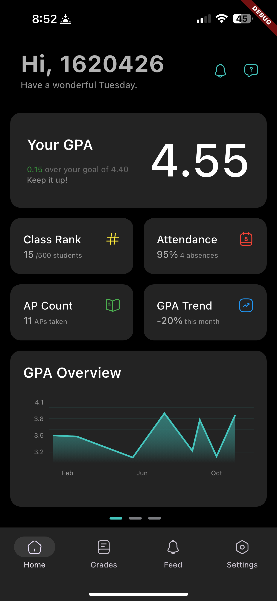
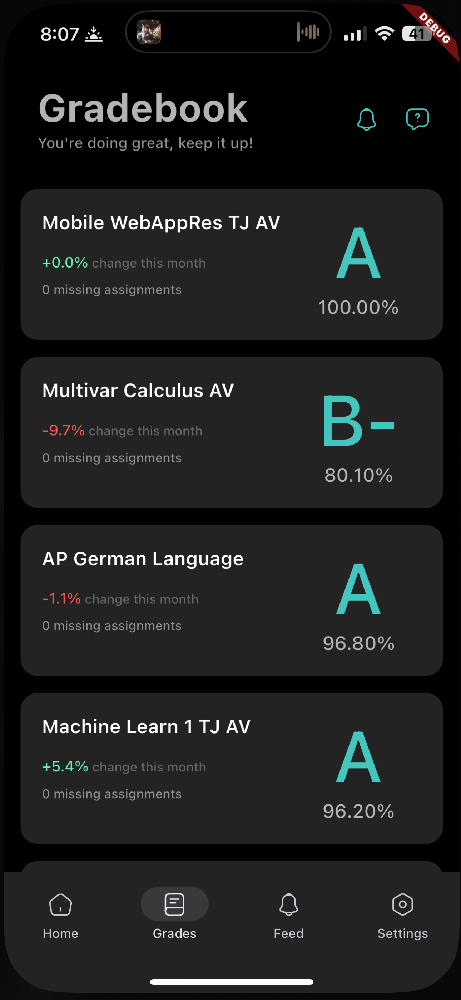
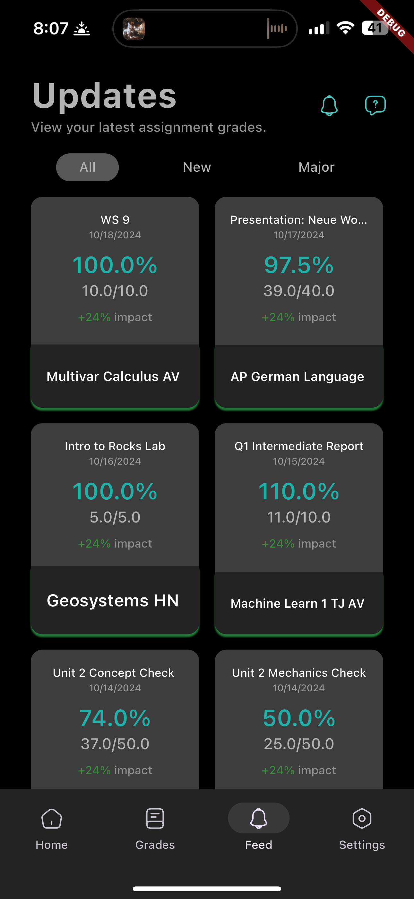

# GeneSIS

GeneSIS is a Flutter app that connects to a student's grading portal, such as StudentVUE, and turns the raw gradebook into a clear read on how they are actually doing. The student signs in with their existing portal credentials, the app loads their gradebook, and it presents current and cumulative GPA, per-class breakdowns, and grade trends over time in a dark-themed dashboard. Login details stay on the device.

## What it does

- Signs in to StudentVUE with the student's own credentials and loads their gradebook
- Handles both rolling and standard gradebooks
- Computes current and cumulative GPA, including partial-year data when a term is still in progress
- Shows grade trends over time, with a color scale that makes each class readable at a glance
- Keeps credentials on the device instead of sending them anywhere else
- Includes profile and settings screens for customization

## Screenshots

<table>
  <tr>
    <td align="center"> <b>Dashboard</b></td>
    <td align="center"> <b>Gradebook</b></td>
    <td align="center"> <b>Feed</b></td>
  </tr>
</table>

## Tech

- Flutter and Dart for the app
- GetX for state management and routing, GetStorage for local persistence
- fl_chart for the grade-trend charts
- Firebase (Auth and Firestore) for account features
- [studentvue](https://github.com/IshanA2007/studentvue), a Dart client library I wrote to talk to the StudentVUE SOAP API, which is what GeneSIS uses to pull gradebook data

## How it is organized

The code follows a feature-first layout under `lib/`. Screens sit under `features/`, shared data and repositories under `data/` and `common/`, and the cross-cutting helpers (theming, GPA math, HTTP, local storage, validators) under `utils/`. The GPA and grade calculations live in the helpers so the UI layer stays thin.

## Running it locally

1. Install Flutter (SDK 3.5 or newer).
2. Run `flutter pub get`.
3. To use the account features, point the app at your own Firebase project and set your Firebase security rules. The Firebase values in the repo are client-side identifiers, which are meant to ship inside a client app, but you should still use your own project.
4. Run `flutter run`.

## A note on credentials

GeneSIS stores a student's portal login locally through GetStorage and sends it only to the grading portal to fetch that student's own data. Nothing is collected on a server.
